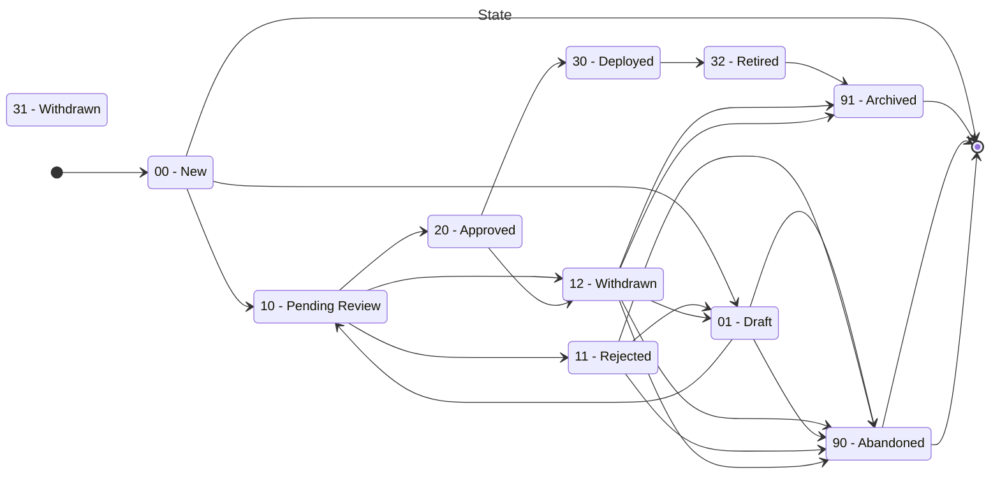

---  
sidebar_position: 2  
sidebar_label: States
title: States of artefacts in the Configuration services
date: 2024-03-05 11:57:38
author: Rob Reeve
description: A visualisation of the states an artefact can pass through
---  

## Introduction

As the various artefacts move through different stages of deployment, their state is updated, until such time as they are either archived or abandoned. Different processes will ensure that only authorised parties move artefacts between the states, and as they are moved, all these changes are captured in an auditable log.

## States

## Open Questions

12 and 31 are both withdrawn, is 31 valid, as a withdrawn from Deployed is managed from 32? So use 32 to 01

31 --> 01 is this a withdrawn config that is then sent back to draft, surely this should come from an existing definition and be brought back as a new ID

We need to discuss the decommissioning of a rule config.
A rule will be deployed, then retired - either because it is no longer needed, or it is replaced. If you are updating, you should have created a new one.

How do I get to a rule configuration?
I need to edit an existing rule, and select its configuration
Or create a new rule

(c) LexTego ltd 2021-2024
