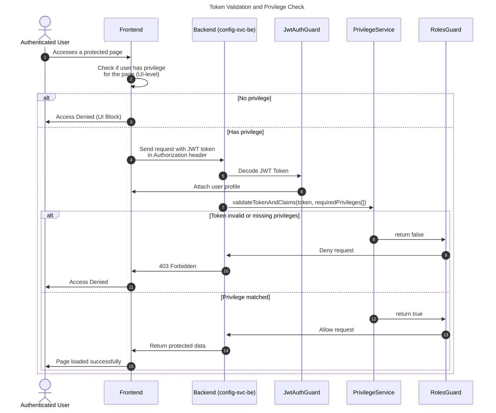

## Introduction

The `auth-lib` is used within the `config-svc-be` service to validate JWT tokens and determine whether a user has the required privileges to access a specific endpoint. This validation process is critical in ensuring secure role-based access control across both the frontend and backend services in the platform.

## Core Usage Flow

The authentication and authorization process is driven by three primary components:

- **JwtAuthGuard**: Responsible for decoding the token sent from the frontend.
- **PrivilegeService**: Implements `validateTokenAndClaims` to verify if the decoded token includes the required privileges.
- **RolesGuard**: Applied at controller-level to enforce access control based on the results from the PrivilegeService.

## Access Control Flow

## Template Key Verification

**Current Issue**

There is a known issue related to template keys, but the root cause remains unclear due to insufficient documentation on the key creation process.

 - Verification of test keys received from Tazama works correctly using the auth-lib.

 - Manually created template keys do not work, despite appearing structurally correct.

 - No formal documentation currently exists that explains how template keys should be generated, what claims they should include, or what signing logic is required.

**Statement of Problem**

"There is an issue related to template keys, but it is unclear whether the problem is with key verification or key creation."

"Ability to test template key functionality is critical to resolving this issue."

This indicates that both areas — key creation and key verification — are potentially at fault.

**Findings So Far**

 - Keys received from Tazama validate correctly using validateTokenAndClaims.
 - Keys created manually based on assumptions fail validation.
 - Lack of documentation makes it impossible to confirm if keys are being constructed correctly or verified using the right logic.

