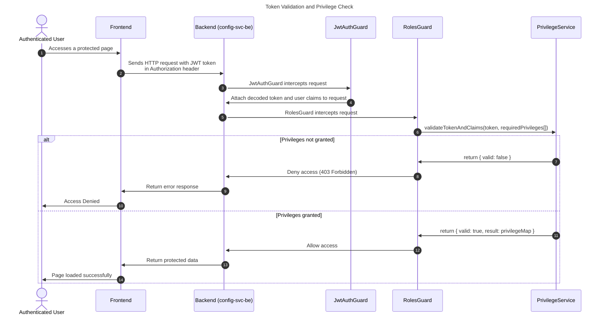

## Introduction

The `auth-lib` is used within the `config-svc-be` backend service to perform JWT validation and privilege verification to determine whether a user has the required privileges to access a specific endpoint. 

It exports a single method, `validateTokenAndClaims`, which is integrated into the backend's role-based access control system via locally implemented guards and services such as `JwtAuthGuard`, `PrivilegeService`, and `RolesGuard`.

This validation process is critical in ensuring secure role-based access control across both the frontend and backend services in the platform.

## Core Usage Flow

The auth-lib provides a single exported method:

- **validateTokenAndClaims(token, requiredPrivileges[])** – Validates the JWT token and checks whether the user has the specified privileges. This function is the entry point to all auth-lib logic.

The authentication and authorization process is driven by three primary components in `config-svc-be`:

- **JwtAuthGuard**: Responsible for extracting and decoding the JWT token sent from the frontend. It attaches the raw token and the decoded user payload to the request object so that `RolesGuard` can access it.
- **RolesGuard**: Reads the attached token and required privileges for a controller method, and delegates privilege verification to the `PrivilegeService`. It enforces access control by allowing or denying the request.
- **PrivilegeService**: Calls `validateTokenAndClaims` from `auth-lib`, which returns a map of privileges indicating whether the requested access rights are granted (`true` or `false`) based on the token provided.

## Access Control Flow

## Template Key Verification

**Current Issue**

There is a known issue related to template keys, but the root cause remains unclear due to insufficient documentation on the key creation process.

 - Verification of test keys received from Tazama works correctly using the `auth-lib`.

 - Manually created template keys do not work, despite appearing structurally correct.

 - No formal documentation currently exists that explains how template keys should be generated, what claims they should include, or what signing logic is required.

**Statement of Problem**

"There is an issue related to template keys, but it is unclear whether the problem is with key verification or key creation."

"Ability to test template key functionality is critical to resolving this issue."

This indicates that both areas — key creation and key verification — are potentially at fault.

**Findings So Far**

 - Keys received from Tazama validate correctly using `validateTokenAndClaims`.
 - Keys created manually based on assumptions fail validation.
 - Lack of documentation makes it impossible to confirm if keys are being constructed correctly or verified using the right logic.

