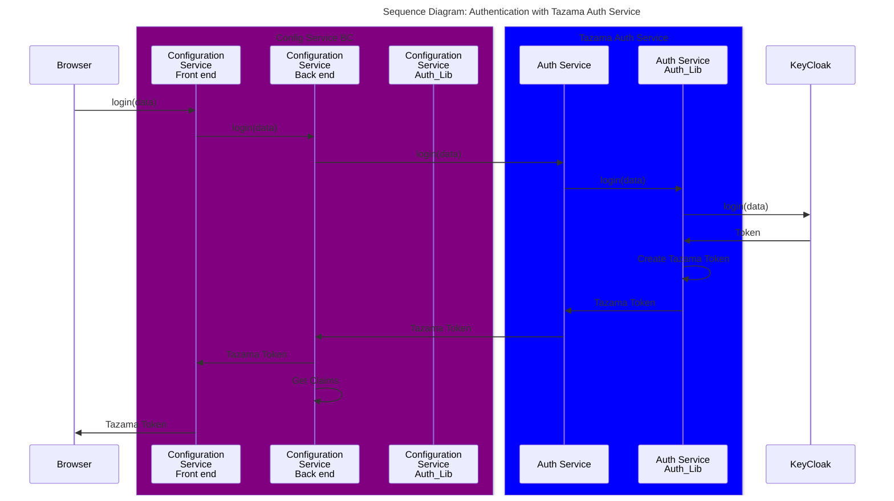
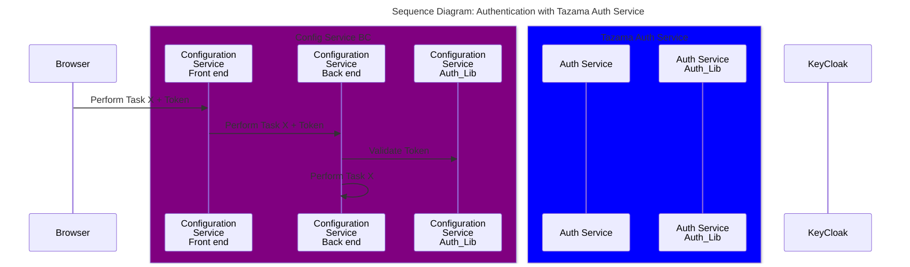

## Installation steps taken

Clone the Full-Stack-Docker-Tazama repository to local machine. Remove the arango dependency and  execute the following command from within the Full-Stack-Docker-Tazama folder:

```bash
docker compose -f docker-compose.auth.yaml -p tazama up -d
```

We are able to login and see users, and create new users using the instructions [here](https://github.com/tazama-lf/docs/blob/dev/Guides/keycloak-operator.md)

We can then test with Postman by sending a Post request with a username and password to the http://<hostname>:3020/v1/auth/login endpoint to fetch the Tazama JWT token.

So far all good. We then struggle to validate this token against the Auth-Lib in the config service back end

## Other Issues found

We have identified the following issues:

**Misalignment on fields to use for login**

Given the multi-tenant requirements, email will be the primary use case, as such email was adopted for the config service

Mismatch as below:

|  Service  | User     | email            | Pwd      |
|-----------|----------|------------------|----------|
| KeyCloak  | username | email@domain.com | password |
| Config    |          | email@domain.com | password |
| Auth      | username |                  | password |

We can temporarily work around this, by creating users where their username is their email address.

## Authentication with Tazama Auth Service

Back to the core issue, we have adopted the following design

The user will be authenticated with the Tazama Auth Service. The user will be required to enter their email address and password. The Tazama Auth Service will validate the user against Keycloak and then return a token to the user. This token will be used to authenticate the user for all future requests to the config service back end, until such time as it expires.



When we come to validate the token, we send the token into the Config Service, and then use the Auth Lib to validate this token.



## Installation of Auth-Lib in Config Service Backend

### Documented install

```bash
npm install @tazama-lf/auth-lib
```
Comes back with Not found

```
npm install @tazama-lf/auth-lib
npm error code E404
npm error 404 Not Found - GET https://registry.npmjs.org/@tazama-lf%2fauth-lib - Not found
npm error 404
npm error 404  '@tazama-lf/auth-lib@*' is not in this registry.
npm error 404
npm error 404 Note that you can also install from a
npm error 404 tarball, folder, http url, or git url.
```

### Approach requested

add an .npmrc

```bash
@tazama-lf/auth-lib:registry=https://npm.pkg.github.com
//npm.pkg.github.com/:_authToken=${GH_TOKEN}
```

ensure the config service package.json has the following

```bash
"dotenv": "^16.0.3"
"tslib": "^2.6.3"
```

then run

```bash
npm install https://github.com/frmscoe/auth-lib
```

this leads to a failed download (content of the auth-lib folder are empty)

### Workaround

We side load the Auth-lib with the following command by moving into the packages folder of config-service

```bash
git clone https://github.com/tazama-lf/auth-lib.git`
```

this leaves the following three folders

```bash
   - auth-lib
   - config-svc-be
   - config-svc-fe
```

```cd auth-lib```
```nvm use 22.14```
```npm install``` This ensures dependencies are installed
```cat /path/to/auth-lib/package.json | grep '"main"'``` Ensure Auth-lib has the `main` entry

Expected output:
```json
	"main": "lib/index.js",
	"types": "lib/index.d.ts"
```

```rm -rf lib``` Removes the `lib` folder from `auth-lib`, just incase it was built during `npm install`

```npx tsc --build``` build it again

```ls lib``` verify that it's built properly

Expected output:
```bash
	index.js
	index.d.ts
	services/
	interfaces/
```

```cd /path/to/config-svc-be```. Install into config-svc-be  
```npm install /path/to/auth-lib --save``` eg ```npm install ../auth-lib --save```  
```ls node_modules/@tazama-lf/auth-lib``` Verify that auth-lib is installed without linking  
 
Expected output:  
```ts
	index.js
	index.d.ts
	package.json
	lib/
```
```npx tsc --build --force```
```npm run build```